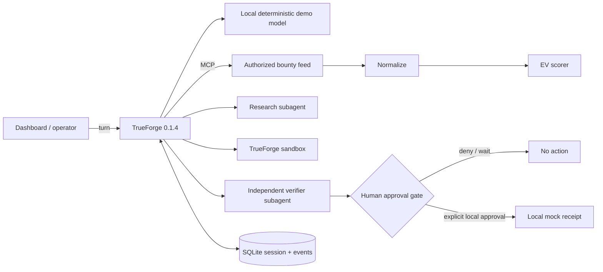

# Opportunity Operator

Opportunity Operator is a safety-first agent that finds authorized bounty opportunities, normalizes them, calculates transparent expected value, delegates research, runs deterministic checks in an isolated sandbox, asks an independent verifier, and **stops for human approval** before a local-only mock submission.

Built during The Agent Harness Hackathon on 2026-08-24. TrueForge is the runtime, not a wrapper: it owns the model loop, MCP tool dispatch, local sandbox, dynamic subagents, persisted sessions, event stream, and approval/resume protocol.

## What the demo proves

- A public/authorized fixture enters through an MCP tool, never by hidden application logic.
- TrueForge delegates research and verification into separate dynamic subagent threads.
- A candidate assertion is executed through TrueForge's standalone isolated sandbox.
- `mock_irreversible_submit` is declared destructive and explicitly gated in the agent spec.
- The first turn ends paused. A distinct approval event resumes it; the tool can only create a local mock receipt.
- The session and event history are stored in TrueForge's SQLite database and can be reloaded.

## Architecture



## Run locally

Requires Node.js 22.14+ on macOS or Linux.

```bash
npm install
npm test
npm run demo:all
```

Then open `http://127.0.0.1:4173`. `demo:all` starts the local MCP server, deterministic OpenAI-compatible demo endpoint, TrueForge, and dashboard; runs the workflow; checks persistence after a TrueForge restart; and shuts services down. It never needs a real model key or external account.

To leave the workflow paused instead of approving the local mock, start the services and run `npm run demo` without `--approve-local-mock`.

## TrueForge integration

The inline agent spec enables `sandbox`, `dynamicSubAgents`, context persistence, and the configured `opportunity-tools` MCP server. All tool schemas are loaded by the harness. The submit tool is protected with:

```js
requireApprovalForTools: ['mock_irreversible_submit']
```

TrueForge emits `tool.approval_required`, ends the turn in a paused state, and accepts a separate `user.tool_approval` input to resume. The dashboard reads the resulting trace artifact; it does not simulate harness evidence.

The deterministic model endpoint exists only so judges can reproduce the full harness behavior with no paid key. It selects tools; it does not execute them. TrueForge remains responsible for every tool call, subagent thread, sandbox command, pause, resume, and persisted event.

## Safety boundaries

- Localhost binding only; standalone TrueForge is never exposed publicly.
- No wallet, signing, payment, publishing, login, or submission credentials exist.
- The feed is an explicitly authorized local fixture with source URLs for provenance.
- The only write-like MCP tool returns a local JSON receipt and has no network client.
- Independent verification fails closed on authorization and EV checks.
- Real GitHub/Qodo/hackathon submission is deliberately outside this repo's executable path.

See [SECURITY.md](SECURITY.md) for the threat model.

## Tests

`npm test` covers schema normalization, EV calculations, fail-closed verification, and deterministic model routing. `npm run verify` also checks required submission documentation. The end-to-end demo asserts MCP, sandbox, at least two subagents, approval pause, and session persistence were all observed from TrueForge events.

## AI coding disclosure

OpenAI Codex was used as an AI coding assistant for implementation, documentation, test generation, and debugging. The participant directed the product scope and safety constraints and must review, understand, and be able to explain all submitted code. The reproducible tests and captured TrueForge event trace provide human-verifiable evidence; no claim relies solely on generated prose.

## Hackathon compliance

Original project code and design began on 2026-08-24 during the published hackathon window. Dependencies and public frameworks are credited through `package-lock.json`. Before submission, a human must create the public repository, review the disclosure, record the demo, optionally run Qodo for the code-quality track, and submit through the event account.

MIT licensed. See [LICENSE](LICENSE).
